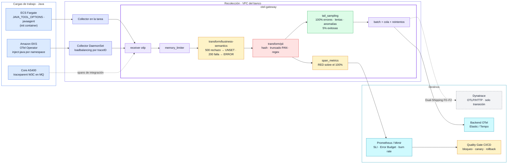

# sre-finops-otel-collector

**Owner:** Plataforma de Confiabilidad · **Modelo:** InnerSource (PRs abiertos a todas las verticales) · **Estado:** PoC

Plataforma de telemetría para la migración del APM propietario (Dynatrace OneAgent) a OpenTelemetry con
backend agnóstico. Las verticales migran sin cambiar una línea de código fuente y sin perder visibilidad
durante la ventana de transición del APM legado (12 meses).

## Problema de negocio

| Dolor actual | Impacto | Control en este repositorio |
|---|---|---|
| Agente propietario embebido en cada aplicación crítica | Lock-in; la migración extiende el costo de licencia | Agente Java OTel (cero código) + Dual-Shipping desde el Gateway |
| Rechazos de negocio (riesgo, fraude) devueltos como HTTP 500 | Tasa de error inflada, alertas falsas, SLO no confiables | `transform/business-semantics`: el rechazo no consume Error Budget |
| Fallas de sistema devueltas como HTTP 200 | Fallas invisibles hasta la queja del cliente | `transform/business-semantics`: la falla consume Error Budget y se retiene al 100% |
| Trazas sin contexto de negocio | Imposible priorizar por impacto ni identificar operaciones afectadas | Convenciones `business.*` + cliente correlacionable por hash |
| Alertas por umbral estático (CPU, memoria) | Fatiga de guardia y falsos positivos | Alertas por burn rate multiventana sobre el SLO |
| Ingesta masiva de telemetría | Costo creciente del backend, sea cual sea | Tail sampling + métricas RED en el Gateway (reducción > 90% de trazas) |
| Equipo transversal reducido frente al número de aplicaciones | La migración no escala si depende del equipo central | Autoservicio: activación por namespace / task definition vía PR |
| PII en telemetría | Incumplimiento SFC / PCI-DSS si sale de la red del banco | Enmascaramiento en el Gateway, antes de cualquier exporter |

## Arquitectura



| Componente local | Rol | Imagen | Puerto |
|---|---|---|---|
| otel-gateway | Gateway | `otel/opentelemetry-collector-contrib:0.162.0` | 4317/4318 OTLP · 8888 interno · 8889 RED · 13133 health |
| apm-legacy | Stand-in de Dynatrace (recibe OTLP/HTTP) | `jaegertracing/jaeger:2.22.0` | 16686 |
| otel-backend | Stand-in del backend OTel | `jaegertracing/jaeger:2.22.0` | 16687 |
| prometheus | SLI, Error Budget, alertas | `prom/prometheus:v3.13.4` | 9090 |
| traffic-generator | Emula servicios Java autoinstrumentados | build local (OTel SDK 1.45.1) | — |

Imágenes multi-arch; ejecución nativa en arm64. Los artefactos de despliegue reales están en `deploy/`.

## Migración cero código

El agente Java de OpenTelemetry (2.32.0) reemplaza a OneAgent sin recompilar ni modificar imágenes.

| Plataforma | Mecanismo | Artefacto |
|---|---|---|
| Amazon EKS | OTel Operator; anotación `instrumentation.opentelemetry.io/inject-java` a nivel de namespace | `deploy/eks/instrumentation.yaml` |
| Amazon EKS | Collector por nodo (DaemonSet) con enrutamiento por traceID hacia el Gateway | `deploy/eks/otel-node-collector.yaml` |
| ECS Fargate | Init container copia el agente a un volumen compartido; `JAVA_TOOL_OPTIONS=-javaagent:...`; Collector en la tarea | `deploy/ecs-fargate/task-definition.json` |

Reglas de la migración:

- **Un agente por JVM.** OneAgent y el agente OTel no coexisten; el cambio que activa uno desactiva el otro
  (exclusión del namespace en DynaKube, o nueva revisión de la task definition).
- **Rollback = revertir el PR.** Reactiva OneAgent en minutos; no hay estado que migrar.
- **Muestreo en el Gateway.** El SDK exporta el 100% (`parentbased_always_on`); la decisión se toma con la traza completa.
- **Continuidad de dashboards.** Dynatrace sigue recibiendo la telemetría vía Dual-Shipping (endpoint
  `/api/v2/otlp`, token con scope `openTelemetryTrace.ingest`). Los atributos `business.*` se agregan a la
  allow-list de atributos de span de Dynatrace en F0.

## Semántica de negocio

El código HTTP no es fuente de verdad del resultado transaccional. Contrato InnerSource:

| Cabecera de respuesta | Atributo normalizado | Valores |
|---|---|---|
| `X-Business-Operation` | `business.operation` | `pago_qr`, `transferencia`, … |
| `X-Business-Outcome` | `business.outcome` | `approved` · `declined` · `failed` |
| `X-Business-Reason` | `business.reason` | `OK`, `RIESGO_ALTO`, `FONDOS_INSUFICIENTES`, `ERROR_SISTEMA`, … |
| — (derivado de `payment.amount`) | `business.amount_band` | `bajo` · `medio` · `alto` |

El agente captura las cabeceras por configuración (`OTEL_INSTRUMENTATION_HTTP_SERVER_CAPTURE_RESPONSE_HEADERS`).
Las aplicaciones que aún no las emiten se cubren con una extensión del agente (InnerSource) que mapea los
códigos de respuesta existentes; en ningún caso se modifica el código de la aplicación.

Normalización en el Gateway (antes de `span_metrics`, por lo que el SLI ya refleja el resultado corregido):

| HTTP | `business.outcome` | Estado del span | `business.status_reclassified` | Error Budget |
|---|---|---|---|---|
| 2xx | `approved` / `declined` | UNSET | — | No consume |
| 5xx | `declined` | ERROR → **UNSET** | `declined_as_5xx` | No consume |
| 2xx | `failed` | UNSET → **ERROR** | `failed_as_2xx` | **Consume** |
| 5xx | `failed` | ERROR | — | Consume |

`http.response.status_code` se conserva sin modificar como evidencia para la corrección del contrato en la aplicación.

## Plan de migración por fases

| Fase | Plazo | Alcance | Criterio de salida |
|---|---|---|---|
| **F0 · Fundación** | Meses 0–2 | Gateway por cuenta/VPC con PII, semántica de negocio, sampling y Dual-Shipping; backend OTel; módulos IaC; allow-list de atributos en Dynatrace | Gateway entrega a ambos destinos sin pérdida; `PII-001` y `BIZ-001` en PASS |
| **F1 · Piloto** | Meses 2–4 | 1–2 aplicaciones no críticas: OneAgent → agente OTel; comparación lado a lado en ambos backends | Paridad de trazas ≥ 95%; sobrecosto de latencia < 3%; rollback a OneAgent ejecutado y probado |
| **F2 · Olas por criticidad** | Meses 4–10 | Olas de 5–10 aplicaciones, de menor a mayor criticidad; SLO, alertas y dashboards como código; pruebas de caos por ola | Cada ola con SLO y alertas por burn rate equivalentes o superiores a las de Dynatrace |
| **F3 · Cutover** | Meses 10–12 | Retiro de `otlp_http/dynatrace` del Gateway (lectura histórica primero); cierre de licencia antes del vencimiento | Cero aplicaciones con OneAgent; ningún dashboard crítico depende de Dynatrace |

Ninguna fase requiere cambios en el código de las aplicaciones; por eso el plan admite compresión (p. ej.,
F1 y F2 en 3 meses) si el negocio adelanta el cutover.

## Operación

```bash
make up              # despliegue del stack
make validate        # config del Gateway contra el binario del Collector
make validate-rules  # reglas SLO con promtool
make verify          # Quality Gates de telemetría (≥ 60 s de tráfico)
make gate            # Quality Gate pre-deploy (Error Budget)
make release VERSION=1.1.0 PROFILE=stable      # gate → deploy → canary
make release VERSION=1.2.0 PROFILE=regression  # fallas ocultas en 200 → canary FAIL → rollback
make rollback        # rollback manual
make incident        # inyección de fallo: 30% de errores técnicos
make down            # teardown
```

Mix del generador (variables de entorno): `P_TECH_ERROR`, `P_HIDDEN_ERROR_200`, `P_RISK_DECLINE_500`,
`P_FUNDS_DECLINE_200`, `P_SLOW`, `P_HIGH_VALUE`, `TPS`, `APP_VERSION`. Baseline dentro del SLO.

## Quality Gates

### Telemetría

`scripts/verify.py` · exit `0` PASS · `1` FAIL · `2` NO_DATA

| Gate | Control | Criterio | Tipo |
|---|---|---|---|
| PII-001 | Escaneo de PAN, email e IDs numéricos en ambos destinos; llaves prohibidas | 0 violaciones | Bloqueante |
| BIZ-001 | Estado del span consistente con `business.outcome`; reporta tasa de error por HTTP vs. tasa técnica real | 0 inconsistencias | Bloqueante |
| FINOPS-001 | Spans recibidos vs. exportados por el Gateway | Reducción ≥ 30% | Bloqueante |
| SLO-001 | Disponibilidad técnica de `payments-qr` | ≥ 99.95% | Informativo |

### Error Budget (CI/CD)

`scripts/error_budget_gate.py` · SLO como código en `slo/payments-qr.yaml` · exit `0` PROCEED · `1` BLOCK/FAIL

```
workflow_dispatch ─► error-budget-gate ─► deploy ─► canary-analysis ─┬─► OK
                      (pre-deploy)                  (service.version) └─► FAIL ─► rollback
```

| Gate | SLI | Política |
|---|---|---|
| EB-001 | Disponibilidad ≥ 99.95% sobre el estado normalizado | Budget agotado o fast burn → BLOCK · slow burn → WARN |
| EB-002 | Latencia: ≥ 99% de pagos < 800 ms | Igual a EB-001 |
| CANARY-001 | Burn rate de la nueva `service.version` | 2 evaluaciones consecutivas > 14.4x → FAIL + rollback |
| — | Sin telemetría | Fail-closed: BLOCK |
| — | Volumen < 20.000 requests en la ventana | Budget no significativo: solo aplican checks de burn rate |

| Ventana | prod | poc |
|---|---|---|
| Budget | 30d | 30m |
| Fast burn (14.4x) | 1h / 5m | 5m / 1m |
| Slow burn (6x) | 6h / 30m | 15m / 3m |
| Canary | 10m · 30 min | 1m · 3 min |

Pipeline: `.github/workflows/deploy-payments-qr.yaml` sobre runner self-hosted con acceso a Prometheus.
Las mismas reglas alimentan las alertas de la vertical en `prometheus/rules/`.

## Controles

### PII (`transform/pii`)

| Control | Técnica | Resultado |
|---|---|---|
| Identificadores correlacionables | SHA-256 + sal (`PII_HASH_SALT`) | `account.number`, `customer.document` → hash |
| Datos de autenticación (PCI-DSS 3.2) | Eliminación por llave | `cvv`, `pin`, `token`, `password` |
| PAN (PCI-DSS 3.4) | Regex con truncado | `****-****-****-1234` |
| Email, cuentas, cédulas | Regex fail-closed | `[EMAIL_REDACTADO]`, `[NUM_REDACTADO]` |

Cobertura: atributos de span, eventos de excepción, nombres de span y atributos de resource. Secretos
(`PII_HASH_SALT`, `DT_API_TOKEN`) inyectados desde el gestor de secretos. Excepciones al patrón numérico
se tramitan por PR con aprobación de DevSecOps.

### Sampling (`tail_sampling`)

| Política | Retención | Justificación |
|---|---|---|
| `retener-errores` (estado normalizado) | 100% | RCA; incluye fallas ocultas en 2xx, excluye rechazos en 5xx |
| `retener-lentas` (> 800 ms) | 100% | SLO de latencia |
| `retener-alto-valor` (≥ 50 M COP), `retener-anomalias` | 100% | Prevención de fraude |
| `linea-base-exitosas` | 5% | Línea base de comportamiento |

### Trazabilidad con el core

`MQPUT PAGOS.QR.REQ` propaga `traceparent` (W3C) en las propiedades del mensaje MQ hacia el AS400.

## Runbook: Error Budget

| Situación | Acción |
|---|---|
| `EB-00x BLOCK` por budget agotado | Freeze de features. Solo fixes de confiabilidad hasta recuperar budget. |
| Hotfix P0 con budget agotado | Re-ejecutar con `budget_override_reason` = ID del incidente. Queda en el summary del job y se revisa en el post-mortem. |
| `CANARY-001 FAIL` | Rollback ya ejecutado por el pipeline. Post-mortem blameless; la acción correctiva entra al backlog de la vertical. |
| `BIZ-001 FAIL` | Contrato `X-Business-*` incumplido o regla de normalización desactualizada. PR al Gateway o a la extensión del agente. |
| `PaymentsQrErrorBudgetFastBurn` (page) | Guardia de la vertical dueña. Mitigar primero: rollback del último release. |
| `PaymentsQrErrorBudgetSlowBurn` (ticket) | Revisión en horario laboral por la vertical dueña. |

Runner self-hosted:

```bash
# GitHub → Settings → Actions → Runners → New self-hosted runner (macOS / ARM64)
./config.sh --url https://github.com/anfedimo/sre-finops-otel-collector --token <TOKEN>   # labels self-hosted/macOS/ARM64 por defecto
./run.sh
```

## Cutover (F3)

1. Paridad de trazas ≥ 95% entre `apm-legacy` y `otel-backend` durante 30 días.
2. Retirar `otlp_http/dynatrace` de `service.pipelines.traces/export.exporters`.
3. `make validate && make restart`; cerrar licencia.
